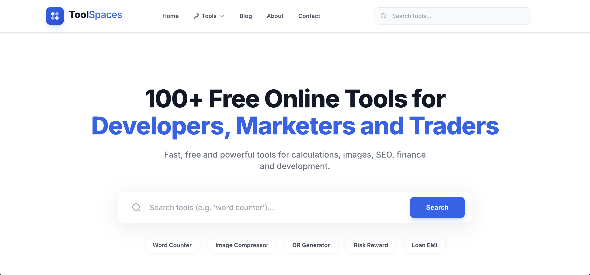

ToolSpaces

  

<h2 align="center">100+ Free Online Tools in One Place</h2>

  A collection of useful, fast, and easy-to-use online tools for everyday digital tasks.

  <a href="https://toolspaces.com">🌐 Main Website</a> •
  <a href="https://toolspaces.netlify.app">🚀 Live Demo</a>

✨ About ToolSpaces

ToolSpaces is an all-in-one online tools platform that brings together 100+ useful web tools in one convenient place.

Instead of searching across multiple websites for simple tasks, users can find calculators, converters, text utilities, image tools, SEO utilities, developer tools, finance tools, trading utilities, PDF tools, and more through one platform.

🛠️ What You Can Find

🧮 Calculators & Converters

✍️ Text & Writing Tools

🖼️ Image Tools

🔎 SEO Tools

💻 Developer Utilities

📄 PDF & Document Tools

💰 Finance & Business Tools

📈 Trading Utilities

🎨 Design Tools

🔄 File & Format Converters

📱 Social Media Utilities

⚡ Productivity & Everyday Tools

🎯 Project Goal

The goal of ToolSpaces is to create a single destination for practical online utilities that are simple, accessible, and useful for students, developers, creators, marketers, businesses, traders, and everyday users.

🌐 Links

Main Website:https://toolspaces.com

Live Demo:https://toolspaces.netlify.app

📌 Project Status

ToolSpaces is an active project and continues to grow with new tools, improvements, and features.

👨‍💻 Created By

Fahad

Built with a focus on creating practical and easy-to-use web tools.

⭐ If you find ToolSpaces useful, consider starring this repository.
